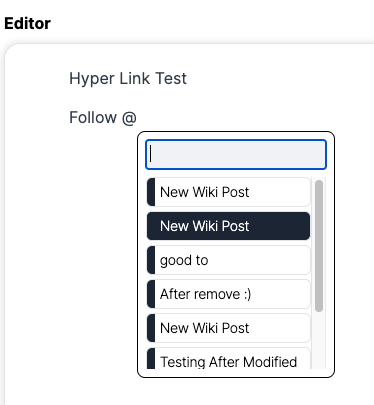

# 사용한 디자인

* 이번 프로젝트 구현을 위해 요구사항에 맞추어 러프하게 만든 시안입니다.

[figma link](https://www.figma.com/file/Xiw56SOSg8bni84z5C506A/coding_hub?type=design&mode=design&t=SStnOgcLeQRuTr2m-1)

# 요구사항 준수 여부

1. 위키페이지는 제목과 본문으로 구성되며 각각 텍스트 입니다. (O)

2. 처음페이지에서는 여러개의 위키페이지제목이 목록으로 나옵니다. (O)

3. 처음페이지에 목록으로 보여지는 제목의 갯수는 5개이며, 5개가 넘어가면 페이지를 구분해서 표시합니다. (O)

4. 메인페이지에서 추가 버튼을 누르면 새로이 입력할 수 있는 창이 나오고, 제목과 내용을 입력할 수 있습니다. (O)

5. 위키페이지 제목을 클릭하면 제목과 본문을 볼 수 있습니다. (O)

6. 위키페이지 본문에 다른 위키페이지의 제목이 있으면 자동으로 링크가 걸리고,클릭하면 해당 위키페이지로 이동합니다. (O)

    이 구문을 저는 "글을 작성할 때 편하게 자동으로 링크를 걸 수 있는 기능"이라 이해하여 Editor component에 특별한 기능을 추가했습니다

    @ 문자를 쓰면 다른 wiki 페이지들로 갈 수 있는 창이 뜨는데 이를 클릭하면 편리하게 링크가 생성됩니다.

    Notion에서 아이디어를 얻어 구현했습니다.

    

7. 위키내용페이지에는 수정 버튼이 있고, 수정을 누르면 내용을 수정해서 저장할 수 있습니다. (O)

추가로 이번 과제에서는 크게 상태 관리 패키지를 사용할 필요성을 못 느껴서 이번 프로젝트에서는 제외했습니다.

## 추가 디테일

1. 완성도 - 과제 전반적인 완성도

    모두 요구사항에 맞추어 구현했다고 생각합니다.

2. 클린코드 - 얼마나 개발자스럽게 효율적으로 코드를 작성하였는지

    중복을 최대한으로 줄이고 코드간 약속된 스타일로 작성하려 했습니다.

    클린코드의 기초인 함수명명법, 변수명명법, 그리고 함수는 간단해야 하는 규칙을 준수하며 구현했습니다.

3. 로직구현 - 얼마나 과업을 이해하고 이에 대한 로직을 구현하려 했는지

    이런 프로젝트 같이 실생활에 많이 쓰일법한 기능은 확장성 및 유연함이 중요하다고 생각해서 이에 맞추어 구현해 보았습니다.

    예시로 삭제 기능도 넣어보았습니다.

    